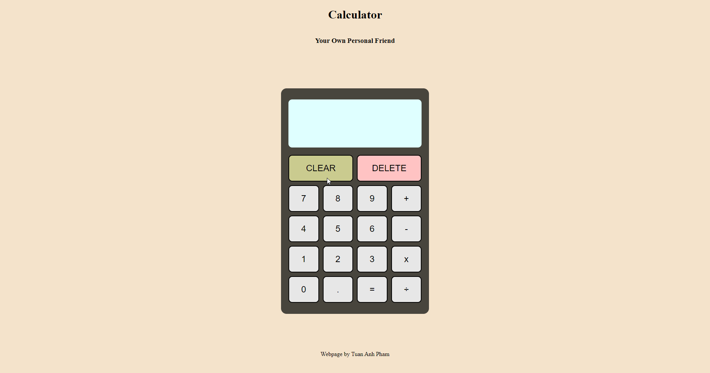

**Calculator**

This project is part of The Odin Project Javascript curriculum. This project allows users to perform simple arithmatic.

The main goal of this project is to combine my accumulated knowledge on the foundations of JavaScript, HTML, and CSS.

**Technologies:**

- Simple HTML, CSS and JavaScript

**Features:**

- Perform basic arithmatic, including addition, subtraction, multiplication and division to decimal points.

**Demo GIF**

